# PreveraSec Simplified ARWAD-Style Flowchart

## 🔄 Advanced Reconnaissance & Web Application Discovery Flow

```mermaid
graph TD
    %% Root Node
    ROOT["🛡️ PreveraSec AppSpec++<br/>Full Grey-Box Context Compiler"]
    
    %% Main Categories
    ROOT --> RECON["🔍 Reconnaissance Phase"]
    ROOT --> INGEST["📥 Ingestion Engine"]
    ROOT --> PROCESS["⚙️ Processing Pipeline"]
    ROOT --> SECURITY["🛡️ Security Analysis"]
    ROOT --> REPORT["📊 Reporting & Output"]
    
    %% Reconnaissance Phase
    RECON --> RECON_PASSIVE["🕵️ Passive Discovery"]
    RECON --> RECON_ACTIVE["🎯 Active Enumeration"]
    RECON --> RECON_INTEL["🧠 Intelligence Gathering"]
    
    %% Passive Discovery
    RECON_PASSIVE --> PASS_API["🔗 API Documentation"]
    RECON_PASSIVE --> PASS_SCHEMA["📋 Schema Mining"]
    RECON_PASSIVE --> PASS_CONFIG["⚙️ Configuration"]
    
    PASS_API --> PASS_OPENAPI["OpenAPI/Swagger"]
    PASS_API --> PASS_GRAPHQL["GraphQL SDL"]
    PASS_API --> PASS_POSTMAN["Postman Collections"]
    
    PASS_SCHEMA --> PASS_TYPES["TypeScript Definitions"]
    PASS_SCHEMA --> PASS_MAPS["Source Maps"]
    PASS_SCHEMA --> PASS_DOCS["Documentation"]
    
    PASS_CONFIG --> PASS_GATEWAY["API Gateway Configs"]
    PASS_CONFIG --> PASS_ENV["Environment Variables"]
    PASS_CONFIG --> PASS_ROLES["Role Matrix"]
    
    %% Active Enumeration
    RECON_ACTIVE --> ACT_PROBE["🔎 Endpoint Probing"]
    RECON_ACTIVE --> ACT_FUZZ["🎲 Parameter Fuzzing"]
    RECON_ACTIVE --> ACT_TRACE["📡 Traffic Analysis"]
    
    ACT_PROBE --> ACT_METHODS["HTTP Methods"]
    ACT_PROBE --> ACT_PARAMS["Parameter Discovery"]
    ACT_PROBE --> ACT_HEADERS["Header Analysis"]
    
    ACT_FUZZ --> ACT_BOUND["Boundary Testing"]
    ACT_FUZZ --> ACT_TYPE["Type Confusion"]
    ACT_FUZZ --> ACT_INJECT["Injection Points"]
    
    ACT_TRACE --> ACT_HAR["HAR File Processing"]
    ACT_TRACE --> ACT_BURP["Proxy Logs"]
    ACT_TRACE --> ACT_NETWORK["Network Monitoring"]
    
    %% Intelligence Gathering
    RECON_INTEL --> INT_SEMANTIC["🧠 Semantic Analysis"]
    RECON_INTEL --> INT_CONTEXT["🎯 Context Mapping"]
    RECON_INTEL --> INT_RAG["📚 RAG Enhancement"]
    
    %% Ingestion Engine
    INGEST --> ING_MULTI["🔄 Multi-Format Parser"]
    INGEST --> ING_VALIDATE["✅ Input Validation"]
    INGEST --> ING_NORMALIZE["📏 Data Normalization"]
    
    ING_MULTI --> MULTI_OPENAPI["OpenAPI Ingestor"]
    ING_MULTI --> MULTI_GRAPHQL["GraphQL Ingestor"]
    ING_MULTI --> MULTI_POSTMAN["Postman Ingestor"]
    ING_MULTI --> MULTI_HAR["HAR Ingestor"]
    ING_MULTI --> MULTI_GATEWAY["Gateway Ingestor"]
    
    %% Processing Pipeline
    PROCESS --> PROC_COMPILE["🔧 AppSpec Compiler"]
    PROCESS --> PROC_ENRICH["✨ Data Enrichment"]
    PROCESS --> PROC_VALIDATE["🔍 Quality Assurance"]
    
    PROC_COMPILE --> COMP_PHASE1["Phase 1: Ingestion"]
    PROC_COMPILE --> COMP_PHASE2["Phase 2: Enrichment"]
    PROC_COMPILE --> COMP_PHASE3["Phase 3: Normalization"]
    PROC_COMPILE --> COMP_PHASE4["Phase 4: Validation"]
    
    %% Security Analysis
    SECURITY --> SEC_DAST["🛡️ DAST Scanner"]
    SECURITY --> SEC_STATIC["📋 Static Analysis"]
    SECURITY --> SEC_THREAT["⚠️ Threat Modeling"]
    
    SEC_DAST --> DAST_INJECTION["💉 Injection Tests"]
    SEC_DAST --> DAST_AUTH["🔐 Authentication Tests"]
    SEC_DAST --> DAST_ACCESS["🚪 Access Control Tests"]
    SEC_DAST --> DAST_CONFIG["⚙️ Configuration Tests"]
    
    DAST_INJECTION --> INJ_SQL["SQL Injection"]
    DAST_INJECTION --> INJ_XSS["XSS Detection"]
    DAST_INJECTION --> INJ_LDAP["LDAP Injection"]
    
    DAST_AUTH --> AUTH_BYPASS["Auth Bypass"]
    DAST_AUTH --> AUTH_WEAK["Weak Authentication"]
    DAST_AUTH --> AUTH_SESSION["Session Management"]
    
    DAST_ACCESS --> ACCESS_BROKEN["Broken Access Control"]
    DAST_ACCESS --> ACCESS_PRIVILEGE["Privilege Escalation"]
    DAST_ACCESS --> ACCESS_IDOR["IDOR"]
    
    DAST_CONFIG --> CONFIG_EXPOSE["Info Disclosure"]
    DAST_CONFIG --> CONFIG_CORS["CORS Misconfiguration"]
    DAST_CONFIG --> CONFIG_RATE["Rate Limiting"]
    
    %% Reporting & Output
    REPORT --> REP_APPSPEC["📄 AppSpec Output"]
    REPORT --> REP_SECURITY["🔒 Security Reports"]
    REPORT --> REP_ANALYTICS["📊 Analytics Dashboard"]
    REPORT --> REP_INTEGRATION["🔗 CI/CD Integration"]
    
    REP_APPSPEC --> APPSPEC_JSON["appspec.json"]
    REP_APPSPEC --> APPSPEC_METRICS["Coverage Metrics"]
    REP_APPSPEC --> APPSPEC_VALIDATE["Validation Results"]
    
    REP_SECURITY --> SEC_VULNS["Vulnerability Report"]
    REP_SECURITY --> SEC_COMPLIANCE["Compliance Report"]
    REP_SECURITY --> SEC_REMEDIATION["Remediation Guide"]
    
    REP_ANALYTICS --> ANAL_DASHBOARD["Web Dashboard"]
    REP_ANALYTICS --> ANAL_METRICS["Performance Metrics"]
    REP_ANALYTICS --> ANAL_TRENDS["Security Trends"]
    
    REP_INTEGRATION --> INT_GITHUB["GitHub Actions"]
    REP_INTEGRATION --> INT_JENKINS["Jenkins Pipeline"]
    REP_INTEGRATION --> INT_GITLAB["GitLab CI/CD"]
    
    %% CLI Control Flow
    CLI["💻 CLI Interface"]
    CLI --> CLI_COMPILE["compile"]
    CLI --> CLI_VALIDATE["validate"]
    CLI --> CLI_SCAN["scan"]
    CLI --> CLI_DIFF["diff"]
    CLI --> CLI_SERVER["server"]
    
    CLI_COMPILE -.-> INGEST
    CLI_VALIDATE -.-> PROC_VALIDATE
    CLI_SCAN -.-> SECURITY
    CLI_DIFF -.-> REP_ANALYTICS
    CLI_SERVER -.-> REP_ANALYTICS
    
    %% Output Flow
    APPSPEC_JSON --> SEC_DAST
    SEC_VULNS --> ANAL_DASHBOARD
    
    %% Color Styling
    classDef rootStyle fill:#1a1a2e,color:#fff,stroke:#16213e,stroke-width:3px
    classDef processStyle fill:#e3f2fd,stroke:#1976d2,stroke-width:2px
    classDef dataStyle fill:#e8f5e8,stroke:#388e3c,stroke-width:2px
    classDef taskStyle fill:#fff3e0,stroke:#f57f17,stroke-width:2px
    classDef warningStyle fill:#ffebee,stroke:#d32f2f,stroke-width:2px
    classDef securityStyle fill:#fce4ec,stroke:#c2185b,stroke-width:2px
    classDef cliStyle fill:#f3e5f5,stroke:#7b1fa2,stroke-width:2px
    
    %% Apply Styles
    class ROOT rootStyle
    class RECON,INGEST,PROCESS,SECURITY,REPORT,PROC_COMPILE,SEC_DAST processStyle
    class APPSPEC_JSON,SEC_VULNS,REP_APPSPEC,REP_SECURITY dataStyle
    class PASS_API,PASS_SCHEMA,ACT_PROBE,ING_MULTI,COMP_PHASE1,COMP_PHASE2,COMP_PHASE3,COMP_PHASE4 taskStyle
    class INJ_SQL,INJ_XSS,AUTH_BYPASS,ACCESS_BROKEN,CONFIG_EXPOSE warningStyle
    class DAST_INJECTION,DAST_AUTH,DAST_ACCESS,SEC_STATIC,SEC_THREAT securityStyle
    class CLI,CLI_COMPILE,CLI_VALIDATE,CLI_SCAN,CLI_DIFF,CLI_SERVER cliStyle
```

## 📋 Simplified Chart Features

### 🎨 **Color Coding**
- **Black**: Root system node
- **Blue**: Main processes
- **Green**: Data outputs
- **Orange**: Tasks and operations
- **Red**: Security vulnerabilities
- **Pink**: Security components
- **Purple**: CLI interface

### 🔧 **Key Components**
1. **Reconnaissance Phase**: Passive/Active discovery + Intelligence
2. **Ingestion Engine**: Multi-format parsing and validation
3. **Processing Pipeline**: 4-phase AppSpec compilation
4. **Security Analysis**: DAST scanning with multiple test categories
5. **Reporting & Output**: Multiple formats and integrations

### ⚡ **Performance Notes**
- Phase 1 (Ingestion): ~120ms
- Phase 2 (Enrichment): ~25ms
- Phase 3 (Normalization): ~8ms
- Phase 4 (Validation): ~3ms
- Total: ~156ms for 6-endpoint API

This simplified version should render properly in GitHub and other Markdown renderers while maintaining the ARWAD-style professional appearance and comprehensive system overview.

---

*Simplified ARWAD-style flowchart | PreveraSec v1.0.0*
