# PreveraSec ARWAD-Style Professional Flowchart

## 🔄 Advanced Reconnaissance & Web Application Discovery (ARWAD) Style Flow

```mermaid
graph TD
    %% Root Node
    ROOT[🛡️ PreveraSec AppSpec++<br/>Full Grey-Box Context Compiler]
    
    %% Main Categories
    ROOT --> RECON[🔍 Reconnaissance Phase]
    ROOT --> INGEST[📥 Ingestion Engine]
    ROOT --> PROCESS[⚙️ Processing Pipeline]
    ROOT --> SECURITY[🛡️ Security Analysis]
    ROOT --> REPORT[📊 Reporting & Output]
    
    %% Reconnaissance Phase
    RECON --> RECON_PASSIVE[🕵️ Passive Discovery]
    RECON --> RECON_ACTIVE[🎯 Active Enumeration]
    RECON --> RECON_INTEL[🧠 Intelligence Gathering]
    
    %% Passive Discovery
    RECON_PASSIVE --> PASS_API[🔗 API Documentation<br/>Discovery]
    RECON_PASSIVE --> PASS_SCHEMA[📋 Schema Mining]
    RECON_PASSIVE --> PASS_CONFIG[⚙️ Configuration<br/>Extraction]
    
    PASS_API --> PASS_OPENAPI[OpenAPI/Swagger<br/>v2.0/3.0/3.1]
    PASS_API --> PASS_GRAPHQL[GraphQL SDL<br/>Introspection]
    PASS_API --> PASS_POSTMAN[Postman Collections<br/>v2.1+]
    
    PASS_SCHEMA --> PASS_TYPES[TypeScript Definitions<br/>.d.ts Analysis]
    PASS_SCHEMA --> PASS_MAPS[Source Map<br/>Extraction]
    PASS_SCHEMA --> PASS_DOCS[Documentation<br/>Scraping]
    
    PASS_CONFIG --> PASS_GATEWAY[API Gateway<br/>Configurations]
    PASS_CONFIG --> PASS_ENV[Environment<br/>Variables]
    PASS_CONFIG --> PASS_ROLES[Role Matrix<br/>Discovery]
    
    %% Active Enumeration
    RECON_ACTIVE --> ACT_PROBE[🔎 Endpoint Probing]
    RECON_ACTIVE --> ACT_FUZZ[🎲 Parameter Fuzzing]
    RECON_ACTIVE --> ACT_TRACE[📡 Traffic Analysis]
    
    ACT_PROBE --> ACT_METHODS[HTTP Methods<br/>Discovery]
    ACT_PROBE --> ACT_PARAMS[Parameter<br/>Enumeration]
    ACT_PROBE --> ACT_HEADERS[Header<br/>Analysis]
    
    ACT_FUZZ --> ACT_BOUND[Boundary<br/>Testing]
    ACT_FUZZ --> ACT_TYPE[Type<br/>Confusion]
    ACT_FUZZ --> ACT_INJECT[Injection<br/>Points]
    
    ACT_TRACE --> ACT_HAR[HAR File<br/>Processing]
    ACT_TRACE --> ACT_BURP[Proxy Logs<br/>Analysis]
    ACT_TRACE --> ACT_NETWORK[Network<br/>Monitoring]
    
    %% Intelligence Gathering
    RECON_INTEL --> INT_SEMANTIC[🧠 Semantic Analysis]
    RECON_INTEL --> INT_CONTEXT[🎯 Context Mapping]
    RECON_INTEL --> INT_RAG[📚 RAG Enhancement]
    
    INT_SEMANTIC --> SEM_CLASSIFY[Parameter<br/>Classification]
    INT_SEMANTIC --> SEM_SENSITIVE[Sensitive Data<br/>Detection]
    INT_SEMANTIC --> SEM_BUSINESS[Business Logic<br/>Mapping]
    
    INT_CONTEXT --> CTX_FRONTEND[Frontend<br/>Integration]
    INT_CONTEXT --> CTX_USER[User Journey<br/>Mapping]
    INT_CONTEXT --> CTX_STATE[State<br/>Management]
    
    INT_RAG --> RAG_DOCS[Documentation<br/>Generation]
    INT_RAG --> RAG_EXAMPLES[Example<br/>Creation]
    INT_RAG --> RAG_TROUBLESHOOT[Troubleshooting<br/>Guide]
    
    %% Ingestion Engine
    INGEST --> ING_MULTI[🔄 Multi-Format Parser]
    INGEST --> ING_VALIDATE[✅ Input Validation]
    INGEST --> ING_NORMALIZE[📏 Data Normalization]
    
    ING_MULTI --> MULTI_OPENAPI[OpenAPI<br/>Ingestor]
    ING_MULTI --> MULTI_GRAPHQL[GraphQL<br/>Ingestor]
    ING_MULTI --> MULTI_POSTMAN[Postman<br/>Ingestor]
    ING_MULTI --> MULTI_HAR[HAR<br/>Ingestor]
    ING_MULTI --> MULTI_GATEWAY[Gateway<br/>Ingestor]
    
    ING_VALIDATE --> VAL_SCHEMA[Schema<br/>Validation]
    VAL_SCHEMA --> VAL_OPENAPI_V[OpenAPI<br/>v2/3 Validation]
    VAL_SCHEMA --> VAL_GRAPHQL_V[GraphQL<br/>SDL Validation]
    VAL_SCHEMA --> VAL_JSON_V[JSON Schema<br/>Validation]
    
    ING_NORMALIZE --> NORM_CONFLICT[Conflict<br/>Resolution]
    ING_NORMALIZE --> NORM_MERGE[Data<br/>Merging]
    ING_NORMALIZE --> NORM_DEDUP[Duplicate<br/>Removal]
    
    %% Processing Pipeline
    PROCESS --> PROC_COMPILE[🔧 AppSpec Compiler]
    PROCESS --> PROC_ENRICH[✨ Data Enrichment]
    PROCESS --> PROC_VALIDATE[🔍 Quality Assurance]
    
    PROC_COMPILE --> COMP_PHASE1[Phase 1:<br/>Ingestion]
    PROC_COMPILE --> COMP_PHASE2[Phase 2:<br/>Enrichment]
    PROC_COMPILE --> COMP_PHASE3[Phase 3:<br/>Normalization]
    PROC_COMPILE --> COMP_PHASE4[Phase 4:<br/>Validation]
    
    PROC_ENRICH --> ENR_SEMANTIC[Semantic<br/>Enrichment]
    PROC_ENRICH --> ENR_FRONTEND[Frontend<br/>Enrichment]
    PROC_ENRICH --> ENR_RAG[RAG<br/>Enrichment]
    
    ENR_SEMANTIC --> SEM_PII[PII<br/>Detection]
    ENR_SEMANTIC --> SEM_FINANCIAL[Financial<br/>Classification]
    ENR_SEMANTIC --> SEM_AUTH[Auth<br/>Requirements]
    
    ENR_FRONTEND --> FE_COMPONENTS[Component<br/>Mapping]
    ENR_FRONTEND --> FE_ROUTES[Route<br/>Analysis]
    ENR_FRONTEND --> FE_STATE[State<br/>Binding]
    
    ENR_RAG --> RAG_OPENAI[OpenAI<br/>Integration]
    ENR_RAG --> RAG_KNOWLEDGE[Knowledge<br/>Base]
    ENR_RAG --> RAG_CONTEXT[Context<br/>Enhancement]
    
    PROC_VALIDATE --> QA_COVERAGE[Coverage<br/>Analysis]
    PROC_VALIDATE --> QA_COMPLETENESS[Completeness<br/>Check]
    PROC_VALIDATE --> QA_CONSISTENCY[Consistency<br/>Validation]
    
    %% Security Analysis
    SECURITY --> SEC_DAST[🛡️ DAST Scanner]
    SECURITY --> SEC_STATIC[📋 Static Analysis]
    SECURITY --> SEC_THREAT[⚠️ Threat Modeling]
    
    SEC_DAST --> DAST_INJECTION[💉 Injection Tests]
    SEC_DAST --> DAST_AUTH[🔐 Authentication Tests]
    SEC_DAST --> DAST_ACCESS[🚪 Access Control Tests]
    SEC_DAST --> DAST_CONFIG[⚙️ Configuration Tests]
    
    DAST_INJECTION --> INJ_SQL[SQL Injection<br/>CWE-89]
    DAST_INJECTION --> INJ_XSS[XSS Detection<br/>CWE-79]
    DAST_INJECTION --> INJ_LDAP[LDAP Injection<br/>CWE-90]
    DAST_INJECTION --> INJ_CMD[Command Injection<br/>CWE-78]
    
    DAST_AUTH --> AUTH_BYPASS[Auth Bypass<br/>CWE-287]
    DAST_AUTH --> AUTH_WEAK[Weak Auth<br/>CWE-521]
    DAST_AUTH --> AUTH_SESSION[Session Management<br/>CWE-384]
    
    DAST_ACCESS --> ACCESS_BROKEN[Broken Access Control<br/>A01:2021]
    DAST_ACCESS --> ACCESS_PRIVILEGE[Privilege Escalation<br/>CWE-269]
    DAST_ACCESS --> ACCESS_IDOR[IDOR<br/>CWE-639]
    
    DAST_CONFIG --> CONFIG_EXPOSE[Info Disclosure<br/>CWE-200]
    DAST_CONFIG --> CONFIG_CORS[CORS<br/>Misconfiguration]
    DAST_CONFIG --> CONFIG_RATE[Rate Limiting<br/>CWE-770]
    
    SEC_STATIC --> STATIC_CODE[Code<br/>Analysis]
    SEC_STATIC --> STATIC_DEPS[Dependency<br/>Scanning]
    SEC_STATIC --> STATIC_SECRETS[Secret<br/>Detection]
    
    SEC_THREAT --> THREAT_MODEL[Threat<br/>Modeling]
    SEC_THREAT --> THREAT_ATTACK[Attack Surface<br/>Analysis]
    SEC_THREAT --> THREAT_RISK[Risk<br/>Assessment]
    
    %% Reporting & Output
    REPORT --> REP_APPSPEC[📄 AppSpec Output]
    REPORT --> REP_SECURITY[🔒 Security Reports]
    REPORT --> REP_ANALYTICS[📊 Analytics Dashboard]
    REPORT --> REP_INTEGRATION[🔗 CI/CD Integration]
    
    REP_APPSPEC --> APPSPEC_JSON[appspec.json<br/>Unified Schema]
    REP_APPSPEC --> APPSPEC_METRICS[Coverage<br/>Metrics]
    REP_APPSPEC --> APPSPEC_VALIDATE[Validation<br/>Results]
    
    REP_SECURITY --> SEC_VULNS[Vulnerability<br/>Report]
    REP_SECURITY --> SEC_COMPLIANCE[Compliance<br/>Report]
    REP_SECURITY --> SEC_REMEDIATION[Remediation<br/>Guide]
    
    SEC_VULNS --> VULN_JSON[scan-results.json]
    SEC_VULNS --> VULN_HTML[vulnerability-report.html]
    SEC_VULNS --> VULN_SARIF[results.sarif]
    
    REP_ANALYTICS --> ANAL_DASHBOARD[Web<br/>Dashboard]
    REP_ANALYTICS --> ANAL_METRICS[Performance<br/>Metrics]
    REP_ANALYTICS --> ANAL_TRENDS[Security<br/>Trends]
    
    REP_INTEGRATION --> INT_GITHUB[GitHub<br/>Actions]
    REP_INTEGRATION --> INT_JENKINS[Jenkins<br/>Pipeline]
    REP_INTEGRATION --> INT_GITLAB[GitLab<br/>CI/CD]
    
    %% CLI Control Flow
    CLI[💻 CLI Interface]
    CLI --> CLI_COMPILE[compile]
    CLI --> CLI_VALIDATE[validate]
    CLI --> CLI_SCAN[scan]
    CLI --> CLI_DIFF[diff]
    CLI --> CLI_SERVER[server]
    
    CLI_COMPILE -.-> INGEST
    CLI_VALIDATE -.-> PROC_VALIDATE
    CLI_SCAN -.-> SECURITY
    CLI_DIFF -.-> REP_ANALYTICS
    CLI_SERVER -.-> REP_ANALYTICS
    
    %% Performance Annotations
    COMP_PHASE1 -.->|120ms| COMP_PHASE2
    COMP_PHASE2 -.->|25ms| COMP_PHASE3
    COMP_PHASE3 -.->|8ms| COMP_PHASE4
    COMP_PHASE4 -.->|3ms| APPSPEC_JSON
    
    %% Output Flow
    APPSPEC_JSON --> SEC_DAST
    SEC_VULNS --> ANAL_DASHBOARD
    
    %% Color Styling
    classDef rootStyle fill:#1a1a2e,color:#fff,stroke:#16213e,stroke-width:4px
    classDef processStyle fill:#e3f2fd,stroke:#1976d2,stroke-width:2px,color:#000
    classDef dataStyle fill:#e8f5e8,stroke:#388e3c,stroke-width:2px,color:#000
    classDef taskStyle fill:#fff3e0,stroke:#f57f17,stroke-width:2px,color:#000
    classDef warningStyle fill:#ffebee,stroke:#d32f2f,stroke-width:2px,color:#000
    classDef securityStyle fill:#fce4ec,stroke:#c2185b,stroke-width:2px,color:#000
    classDef cliStyle fill:#f3e5f5,stroke:#7b1fa2,stroke-width:2px,color:#000
    
    %% Apply Styles
    class ROOT rootStyle
    class RECON,INGEST,PROCESS,SECURITY,REPORT,PROC_COMPILE,SEC_DAST processStyle
    class APPSPEC_JSON,VULN_JSON,VULN_HTML,VULN_SARIF,REP_APPSPEC,REP_SECURITY dataStyle
    class PASS_API,PASS_SCHEMA,ACT_PROBE,ING_MULTI,COMP_PHASE1,COMP_PHASE2,COMP_PHASE3,COMP_PHASE4 taskStyle
    class INJ_SQL,INJ_XSS,AUTH_BYPASS,ACCESS_BROKEN,CONFIG_EXPOSE,SEC_VULNS warningStyle
    class DAST_INJECTION,DAST_AUTH,DAST_ACCESS,SEC_STATIC,SEC_THREAT securityStyle
    class CLI,CLI_COMPILE,CLI_VALIDATE,CLI_SCAN,CLI_DIFF,CLI_SERVER cliStyle
```

## 📋 Chart Legend & Explanation

### 🎨 Color Coding System
- **🖤 Black (Root)**: Core project identity
- **🔵 Blue (Process)**: Main processing components and workflows
- **🟢 Green (Data)**: Data outputs, files, and storage
- **🟡 Orange (Task)**: Individual tasks and operations
- **🔴 Red (Warning)**: Security vulnerabilities and critical findings
- **🟣 Pink (Security)**: Security testing and analysis components
- **🟪 Purple (CLI)**: Command-line interface controls

### ⚡ Performance Annotations
- **Timing indicators** show actual processing times from benchmarks
- **Data flow arrows** indicate information movement between components
- **Control flow (dashed)** shows CLI command routing

### 🔧 Component Hierarchy

#### **Level 1: Root**
- PreveraSec AppSpec++ (Main system)

#### **Level 2: Major Phases**
- Reconnaissance, Ingestion, Processing, Security, Reporting

#### **Level 3: Component Categories**
- Passive/Active discovery, Multi-format parsing, DAST scanning

#### **Level 4: Specific Tools/Methods**
- Individual ingestors, security tests, output formats

#### **Level 5: Technical Details**
- CWE mappings, file formats, specific vulnerabilities

### 🎯 Key Features Highlighted
- **Multi-source ingestion** with format-specific processors
- **4-phase compilation** with performance metrics
- **8 security test categories** aligned with OWASP Top 10
- **Multiple output formats** for different use cases
- **CLI interface** controlling all operations

This ARWAD-style flowchart provides a comprehensive view of PreveraSec's architecture with professional styling and detailed component breakdown suitable for technical documentation and stakeholder presentations.

---

*Chart follows Advanced Reconnaissance & Web Application Discovery (ARWAD) methodology | PreveraSec v1.0.0*
